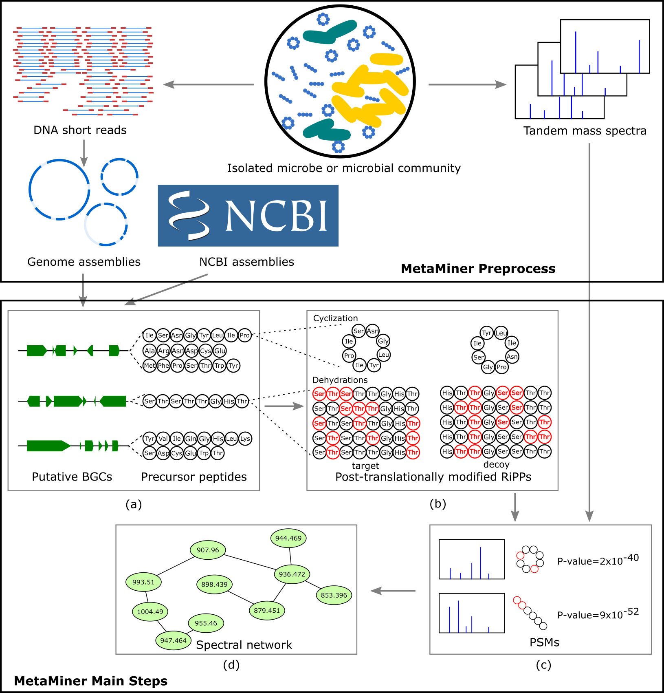

<font size=30>__MetaMiner User Guide v.2.5.0__</font>

written by *Liu Cao, Alexey Gurevich, Hosein Mohimani*

## Table of Contents
* [About MetaMiner](#sec_intro)
* [Input and output](#sec_inout)
    * [Input file format](#sec_input)
    * [Output reports](#sec_output)  
* [Pipeline](#sec_pipeline)
* [Installation](#sec_installation)
    * [Download MetaMiner](#sec_install_metaminer)
    * [Download SPAdes](#sec_install_spades)
    * [Download antiSMASH](#sec_install_antismash)
    * [Download BOA](#sec_install_boa)
* [How to run MetaMiner](#sec_howto)
    * [Run MetaMiner with raw nucleotides sequence files (.fasta)](#sec_howto_fasta)
    * [Run MetaMiner with raw reads files (.fastq)](#sec_howto_fastq)
    * [Run MetaMiner with antiSMASH results (.final.gbk)](#sec_howto_antismash)
    * [Run MetaMiner with BOA results (.fasta)](#sec_howto_boa)
    * [Visualize Spectral (Molecular) Networks of identified RiPPs](#sec_howto_molnet)
    * [Important MetaMiner parameters](#sec_para)
* [Citation](#sec_citation)
* [Feedback and bug reports](#sec_feedback)

<a name="sec_intro"></a>
# About MetaMiner

MetaMiner is a metabologenomic pipeline which integrates metabolomic (tandem mass spectra) and genomic data to identify novel **Ri**bosomally synthesized and **P**ost-translationally modified **P**eptides (RiPPs) and the biosynthetic gene clusters encoding them.

MetaMiner is developed in collaboration of [Carnegie Mellon University](http://mohimanilab.cbd.cmu.edu) (PA, USA), [Saint Petersburg State University](http://cab.spbu.ru) (Russia) and [University of California San Diego](http://cseweb.ucsd.edu/~ppevzner/) (CA, USA) under the Apache 2.0 License. The latest version is available in the **N**atural **P**roduct **D**iscovery **tool**kit (**NPDtools**) at <https://github.com/ablab/npdtools>.

<a name="sec_inout"></a>
# Input and output

MetaMiner takes paired metabolomic and genomic data as input, and output a report summaring all the RiPPs that MetaMiner detected. 

<a name="sec_input"></a>
## Input files format
For metabolomic data, MetaMiner works with liquid chromatography–tandem mass spectrometry data (LS-MS/MS). Spectra files must be centroided and in an open spectrum format (MGF, mzXML, mzML or mzData). 
MetaMiner natively supports MGF, mzXML, mzData and uses msconvert utility from the ProteoWizard package to convert spectra in other formats to MGF.

For genomic data, MetaMiner uses either raw nucleotide sequences or specific genome mining tools' output:

* raw nucleotide sequences `.fasta` format (a high-quality reference or a draft assembly) 
* *antiSMASH*'s `.final.gbk` or `.gbk` file
* *BOA*'s `.annotated.txt` file
* predicted and translated RiPP amino acid sequences in `.fasta` format (e.g. extracted from *BOA*, or *antiSMASH*, or other prediction tool output)

For users who only have DNA short read files (`.fastq`), you can first assemble reads with *SPAdes* or *metaSPAdes*. We provide a brief tutorial about how to assemble DNA short reads to nucleotide sequences using *SPAdes* in section [Run MetaMiner with raw read files](#sec_howto_fastq).

<a name="sec_output"></a>
## Output reports

All the detected RiPPs are reported in plain text tab-separated value files (`.tsv`). 
Each file starts with a header line containing column descriptions. 
The rest lines represent compound–spectrum matches which include information about both the corresponding mass spectrum and the compound. The columns in the report include:  
-  `SpecFile` (filepath of the spectra file)  
-  `Scan` (scan number of the identified spectrum inside the spectra file)  
-  `SpectrumMass` (mass of the spectrum in Daltons)  
-  `Retention` (retention time of the spectrum in seconds)  
-  `Charge` (charge of the spectrum)  
-  `Score` (score of the compound–spectrum match)
-  `P-Value` (statistical significance of the compound–spectrum match)  
-  `FDR` (estimated False Discovery Rate at the corresponding P-Value level)  
-  `PeptideMass` (mass of the compound in Daltons)  
-  `SeqFile` (filepath of the genome sequence file)  
-  `Class` (class of the identified RiPP compound)  
-  `FragmentSeq` (raw initial sequence of the identified compound)  
-  `ModifiedSeq` (the sequence of the identified compound with all applied modifications)  

<a name="sec_pipeline"></a>
# Pipeline

MetaMiner pipeline is as follows:



Starting from the genome assemblies, MetaMiner (i) identifies putative BGCs and the corresponding precursor peptides, (ii) constructs putative RiPP structure databases (iii) matches tandem mass spectra against the constructed post-translationally modified RiPPs structure database using Dereplicator (Mohimani *et al.*, 2017), and (iv) enlarges the set of described RiPPs via spectral networking (Bandeira *et al.*, 2007; Watrous *et al.*, 2012). 
Please refer the [MetaMiner paper](#sec_citation) for more details.

<a name="sec_installation"></a>
# Installation

MetaMiner requires a 64-bit Linux system or macOS and Python (versions 2.6-2.7, 3.3 and higher are supported).   
For parallel processing of multiple spectra or/and sequence files, MetaMiner requires `joblib` Python library. 
If not installed, everything would be processed in a single thread. 
For presenting Spectral Network propagation graphs, MetaMiner also requires `matplotlib` and `networkx` Python libraries. 
If they are not installed, the propagation will be generated in a plain text format only (see `--spec-network` option).

There is no need for compilation of MetaMiner sources. Users can directly download and run the binaries.

<a name="sec_install_metaminer"></a>
##  Download MetaMiner 

Go to the directory in which you wish MetaMiner to be installed and run the following commands to download and extract the NPDtools package (MetaMiner is an integral part of it). 

For Linux users:

```   
    wget https://github.com/ablab/npdtools/releases/download/npdtools-2.5.0/NPDtools-2.5.0-Linux.tar.gz
    tar -xzf NPDtools-2.5.0-Linux.tar.gz
    cd NPDtools-2.5.0-Linux
```

For macOS users:

```   
    curl https://github.com/ablab/npdtools/releases/download/npdtools-2.5.0/NPDtools-2.5.0-Darwin.tar.gz -o NPDtools-2.5.0-Darwin.tar.gz 
    tar -xzf NPDtools-2.5.0-Darwin.tar.gz
    cd NPDtools-2.5.0-Darwin
```

In case of success, you should see the main executable script `metaminer.py` and few more auxiliary executables under `bin/` subdirectory.  
We further refer to the binary simply as `metaminer.py` (consider adding `<NPDtools_installation_dir>/bin/` to the PATH variable).
Sample test data used in this tutorial should be located in `share/npdtools/test_data/` 
and also can be downloaded using the [direct link](https://github.com/mohimanilab/MetaMiner/releases/download/npdtools-2.5.0/test_data.tar.gz) and unpacked. 
In either case, we further refer to it simply as `test_data`. 

<a name="sec_install_spades"></a>
## Download SPAdes binaries

SPAdes will help assembly DNA short reads (`.fastq` file) to nucleotide sequences. For users who have already had `.fasta` or `.final.gbk` file as input, there is no need to download SPAdes.

For Linux users, to download SPAdes (version 3.13.0):

```  
wget http://cab.spbu.ru/files/release3.13.0/SPAdes-3.13.0-Linux.tar.gz  
tar -xzf SPAdes-3.13.0-Linux.tar.gz  
cd SPAdes-3.13.0-Linux/  
```

For macOS binaries:

```  
curl http://cab.spbu.ru/files/release3.13.0/SPAdes-3.13.0-Darwin.tar.gz -o SPAdes-3.13.0-Darwin.tar.gz  
tar -zxf SPAdes-3.13.0-Darwin.tar.gz  
cd SPAdes-3.13.0-Darwin/  
```

<a name="sec_install_antismash"></a>
## Download antiSMASH
After [installing conda](https://conda.io/projects/conda/en/latest/user-guide/install/index.html) with Python 2.7, users can easily install antiSMASH 4 as follows:

```  
# add bioconda channel and its dependencies to conda
conda config --add channels defaults
conda config --add channels bioconda
conda config --add channels conda-forge
# install antiSMASH and create antiSMASH environment
conda create -n antismash antismash
source activate antismash
download-antismash-databases
source deactivate antismash
```

<a name="sec_install_boa"></a>
## Download BOA

After [installing conda](https://conda.io/projects/conda/en/latest/user-guide/install/index.html) with Python 2.7, users can create an environment for BOA and install its dependencies.

```  
# create BOA environment in conda and install its dependencies.
conda create -n boa python=2.7
source activate boa
conda install python-biopython python-matplotlib python-panda python-numpy nltk clustalw cd-hit hmmer
conda install -c bioconda bx-python
source deactivate boa
```

Then users can directly [download BOA](https://github.com/idoerg/BOA/archive/master.zip) from its github repository.

<a name="sec_howto"></a>
# How to run MetaMiner?

<a name="sec_howto_fasta"></a>
## Run MetaMiner with raw nucleotides sequence files (.fasta)

For users who have already obtained the assembled genome/metagenome, a sample run of MetaMiner may look like this:

```  
python metaminer.py test_data/metaminer/metaminer/msms/ -s test_data/metaminer/fasta/ -o metaminer_outdir
```

In this case, all spectra files in `test_data/metaminer/msms/` will be searched against 
all sequence files in `test_data/metaminer/fasta/`. In this particular case, it is a search of `test_data/metaminer/msms/AmfS.mgf` spectrum
against `test_data/metaminer/fasta/S.griseus_fragment.fasta` genome fragment. The search mode (considered RiPP class) is 'lantibiotic' (by default).
The identification results will be saved in `metaminer_outdir`. 
The search is performed with all default parameters, 
see the [corresponding subsection](#sec_para) for the default values and available options.

If the run is finished correctly, you will see identification of a lantibiotic with "TGSQVSLLVCEYSSLSVVLCTP" original sequence 
and "T-18GS-18QVS-18LLVCEYS-18SLSVVLCTP" sequence after modifications in `metaminer_outdir/significant_matches.tsv`.
The modifications "T-18" and "S-18" correspond to dehydrobutyrine and dehydroalanine, respectively.
These sequences correspond to AmfS peptide, you may read more about it in [Ueda et al, 2002](https://www.ncbi.nlm.nih.gov/pubmed/11844785).

<a name="sec_howto_fastq"></a>
## Run MetaMiner with raw reads files (.fastq)

For users who have raw DNA short read files (`.fastq` or `.fastq.gz`), 
it is convenient to assemble them into longer nucleotide sequences (contigs or scaffolds) with *SPAdes* or *metaSPAdes*. 
An example of `SPAdes` run is as follows:

```  
# assemble paired-end short reads using SPAdes
python /path/to/SPAdes/bin/spades.py -1 test_data/metaminer/reads/SRR3309439_subset_R1.fastq.gz -2 test_data/metaminer/reads/SRR3309439_subset_R2.fastq.gz -o spades_outdir
```

where `SRR3309439_subset_R1.fastq.gz` and `SRR3309439_subset_R2.fastq.gz` are paired-end reads file 
(downsampled raw reads from [Streptomyces griseus ATCC 12648](https://www.ebi.ac.uk/ena/data/view/SRR3309439)), 
and `spades_outdir` is the directory containing the genome assembly output. 
Users can use either `spades_outdir/contigs.fasta` or `spades_outdir/scaffolds.fasta` as input of MetaMiner:

```  
# take contigs.fasta as input of MetaMiner
python metaminer.py test_data/metaminer/msms/ -s spades_outdir/contigs.fasta -o metaminer_outdir
```

<a name="sec_howto_antismash"></a>
## Run MetaMiner with antiSMASH results (.final.gbk)
For users who have obtained antiSMASH results, you can directly apply MetaMiner to the GenBank file (`.final.gbk`). An example is as follows:

```  
# take contigs.fasta as input and run MetaMiner
python metaminer.py test_data/metaminer/msms/ -s test_data/metaminer/antismash/ -o metaminer_outdir
```
 
The `.final.gbk` file in the test data folder is generated from `contigs.fasta` by `antiSMASH`. 
While `MetaMiner` successfully detect AmfS using the `contigs.fasta` file, it fails with antiSMASH result as input.

<a name="sec_howto_boa"></a>
## Run MetaMiner with BOA results (.txt)

For users who have obtained BOA results, you can apply MetaMiner to the gene annotation file (`.txt`), which contains a list of annotated genes with their amino acid sequences. An example is as follows:

```  
python metaminer.py test_data/metaminer/msms/ -s test_data/metaminer/boa/ -o metaminer_outdir
``` 

<a name="sec_howto_molnet"></a>
## Visualize Spectral (Molecular) Networks of identified RiPPs

After identifying some RiPPs, users can further enlarge the set of RiPP identifications 
via spectral network and visualize the results. 
Spectral network can be easily run through GNPS. 
Detailed instructions can be found in the [GNPS documentation](https://ccms-ucsd.github.io/GNPSDocumentation/networking/). 
Below is a simple tutorial for using `--spec-network` option of MetaMiner 
to visualize the spectral network of identified RiPP. 
It is based on a few files from [MSV000080102 dataset](https://gnps.ucsd.edu/ProteoSAFe/result.jsp?task=6f7998a85ede41cc8a9b81f43dfe2631&view=advanced_view) 
and an example RiPP `DATITTVTVTSTSIWASTVSNHC` (available in `test_data/metaminer/molnet/example_RiPP.fasta`).

1. Download `C18p_5uL_NASA_Sample_BB2_01_25958.mzML`, 
`C18p_5uL_NASA_Sample_BB3_01_25959.mzML` and 
`C18p_5uL_NASA_Sample_BB4_01_25960.mzML` files from [MSV000080102](ftp://massive.ucsd.edu/MSV000080102/ccms_peak/mzXML/Samples/).  

2. Run spectral networks on the downloaded spectra or 
download their precomputed spectral network from [GNPS](https://gnps.ucsd.edu/ProteoSAFe/status.jsp?task=c69f2f5d09be43bea8587d88cefe997e) (e.g. click on "Download Clustered Spectra as MGF"),
or use the minimal subset of this spectral network output files available in `test_data/metaminer/molnet/ProteoSAFe-METABOLOMICS-SNETS-V2-unpacked/`. 
If using an archive downloaded from GNPS, please unpack it.
We further assume that the unpacked directory is `test_data/metaminer/molnet/ProteoSAFe-METABOLOMICS-SNETS-V2-unpacked`.

3. Run MetaMiner as following (note use of `--blind` here for demonstration purposes):  
    ```  
    python metaminer.py C18p_5uL_NASA_Sample_BB2_01_25958.mzML \
                        C18p_5uL_NASA_Sample_BB3_01_25959.mzML \
                        C18p_5uL_NASA_Sample_BB4_01_25960.mzML \
    -s test_data/metaminer/molnet/example_RiPP.fasta --blind \
    --spec-network test_data/metaminer/molnet/ProteoSAFe-METABOLOMICS-SNETS-V2-unpacked -o metaminer_outdir  
   ```

4. Check the results in `metaminer_outdir/spec_nets/`
This folder should contain three files:
  * `propagations.pdf` (graphical report, each page corresponds to a connected component of a significant PSM)
  * `propagations_detailed.txt`  (detailed text report: for each significant PSM, lists all spectra from the same cluster and from clusters at distance 1 and 2)
  * `propagations_short.txt` (the same as above but lists only one representative per each cluster)

Note: the final reports for this particular example are available in `test_data/metaminer/molnet/output_example/`.


<a name="sec_para"></a>
## Important MetaMiner parameters

Use the following command to see all available parameters, their meaning and default values:

```  
python metaminer.py --help
```

Here is a list of frequently used parameters of MetaMiner:

`-s <path>` (or `--sequence <path>`)  
    Path to a sequnce file  or to a directory with multiple sequence files inside.
    In the latter case, NPDtools recursively walks through the directory and picks up all files 
    with appropriate extensions (`.fna`, `.fasta`, or `.fa` for nucleotide or amino acid FASTA files, 
    `.gbk` for [antiSMASH](https://antismash.secondarymetabolites.org) output, `.txt` for [BOA](https://github.com/nafizh/Boa) output). 
    You can specify an unlimited number of input sequence files/directories, 
    they will be processed independently (see also `--correspondence` option below).
    *We determine sequence file type by its extension. 
    For separating between nucleotide and amino acid FASTA files, the content of a few first entries is analysed.*
    **At least one sequence file is required** unless correspondence file with RefSeq IDs is specified (see `-C` option below).

`-C <filepath>` (or `--correspondence <filepath>`)  
    Path to a file describing correspondence between sequence and spectra files. 
    The file should be tab-separated and has two columns listing basenames of spectra and sequence files.
    Sequence column may include RefSeq IDs prefixed with `#RefSeq:`. In the latter case, 
    the corresponding references are automatically downloaded from NCBI. 
    If not provided, the all-vs-all analysis is performed. An example of valid correspondence file is in 
    `test_data/metaminer/corresp/`.
    
`-c <class>` (or `--class <class>`)  
    Class of RiPPs to look for. Valid choices are: 'formylated',
    'glycocin', 'lantibiotic', 'lap', 'lassopeptide', 'linaridin',
    'proteusin', 'cyanobactin', and 'methanobactin'. You can also specify 'all' to try all classes one by one.
    *The default value is 'lantibiotic'*.  
    
`--blind`                   
    Enable search in a blind mode, i.e. search for new PTMs with arbitrary mass shifts. Could be very slow.
    
`--spec-network`  
    Path to the Spectral Network output 
    ([GNPS Data Analysis workflow](https://gnps.ucsd.edu/ProteoSAFe/index.jsp?params=%7B%22workflow%22:%22METABOLOMICS-SNETS-V2%22,%22library_on_server%22:%22d.speclibs;%22%7D) 
    also known as Molecular Networking). If specified, MetaMiner will identify connected components related 
    to the most significant RiPP identifications and report them in plain text and graphical formats 
    (saved under `<outdir>/spec_nets/`).


<a name="sec_citation"></a>
# Citation
Please cite [Cao et al, Cell Systems, 2019](https://www.cell.com/cell-systems/pdfExtended/S2405-4712(19)30312-6).

<a name="sec_feedback"></a>
# Feedback and bug reports
Your comments, bug reports, and suggestions are very welcomed. 
They will help us to further improve MetaMiner and NPDtools.
You can leave them at [our GitHub repository tracker](https://github.com/ablab/npdtools/issues) 
or sent them via support e-mail: <npdtools.support@cab.spbu.ru>.

